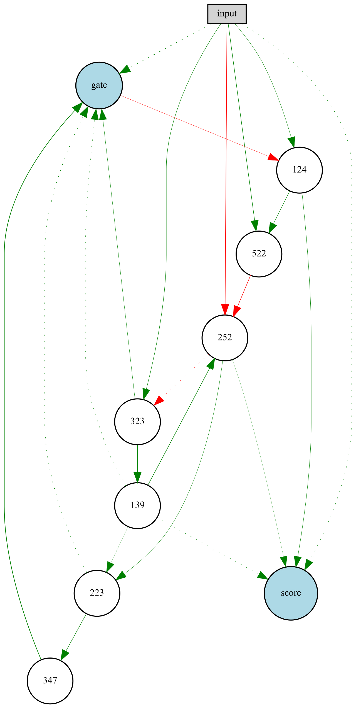

# Anti spoofing
This is the anti spoofing folder. Here are the scripts for running neat on the ASVspoof 2019 database.

## Table of contents
* [General info](#general-info)
* [Screenshots](#screenshots)
* [Files description](#files-description)
* [Schedulers](#schedulers)
* [Note](#note)
* [Future work](#future-work)

## General info
We are using the ASVspoof 2019 logical (LA) database.
The logical train audio files are used for training.
The logical dev and eval audio files are used for testing.

We tested several pre-processing methods to facilitate the learning process of NEAT.

We have tested several fitness functions, the mean square error (mse), 
the cross entropy (ce), the equal error rate (eer),
the ease of classification (eoc) and variants of ease of classification.

We use numpy arrays and tensors to handle the data.

## Screenshots


Topology of a genome obtained by running neat on the ASVspoof 2019 database.


## Code Examples

Loading the dataset, for more details please look at the data_utils files.
```python
train_loader = ASVDatasetshort(None, nb_samples=nb_samples_train)
```

run function present in every main_(...).py files in order to run neat:
```python
def run(config_file, n_gen):
    """
    Launches a run until convergence or max number of generation reached
    :param config_file: path to the config file
    :param n_gen: lax number of generation
    :return: the best genontype (winner), the configs, the stats of the run and the accuracy on the testing set
    """
    # Load configuration.
    config_ = neat.Config(neat.DefaultGenome, neat.DefaultReproduction,
                          neat.DefaultSpeciesSet, neat.DefaultStagnation,
                          config_file)

    # Create the population, which is the top-level object for a NEAT run.
    p = neat.Population(config_)

    # Add a stdout reporter to show progress in the terminal.
    p.add_reporter(neat.StdOutReporter(True))
    stats_ = neat.StatisticsReporter()
    p.add_reporter(stats_)
    p.add_reporter(neat.Checkpointer(generation_interval=100))

    # Run for up to n_gen generations.
    multi_evaluator = Anti_spoofing_Evaluator(n_processes, eval_genome, batch_size, train_loader)
    winner_ = p.run(multi_evaluator.evaluate, n_gen)
```

## Files description

* Python files for running neat are named like the following:
    * main_\[ dataset for training ]\_[ fitness function ]\.py
     
     * For example: main_toy_data_set_mse means that
        * The dataset used is the toy dataset
        * The fitness function used is the mean square error
     
     * Regarding the dataset:
        * train means that we are using the entire logical train dataset for training
            * It is only used with neat-pytorch since it is much faster
        * train_short means that we are using a subset of the logical train dataset for training
            * It is used with neat-python
        * toy_data_set means that we are using 10 files from the logical train dataset for training
            * * It is used with neat-python

    *  Inside the main files, you can find: 
        * run function (always present)
        * eval genome(s) for computing the fitness
            * eval_genome is used for single processing
            * eval_genomes is used for multi processing
            * for neat-pytorch implementation (main_train(_fitness_funtion)), 
            see the corresponding eval_functions file
     
* utils.py contains auxiliary code to normalize audio files, use gates, ...

* data\_utils.py and data\_utils\_short.py files are used for loading the dataset.
    * Adapted from https://github.com/nesl/asvspoof2019, Author: Moustafa Alzantot
    * data_utils_visualization.py and data_utils_short_visualization.py files plot some 
    statistics about the dataset (length of the audio files, distribution of spoofed files).
    
* show_gates.py plots some some statistics about the weights ofr a saved population 
with neat.Checkpointer. It is only working with raw audio files and neat-python.
We may implement the others a next time

* metrics_utils.py file implements the error equal rate 
    * Implemented by Andreas Nautsch (EURECOM) and Themos Stafylakis (Omilia),
      source code available [here](https://gitlab.eurecom.fr/nautsch/pybosaris)
    * libmath.py contains auxiliary code used by metrics_utils.py.

* neat.cfg configuration file that defines the parameters of the neat algorithm

---

There is an exception to that rule: [main_train.py](main_train.py) that allows flexibility in the runs. Below the header, you can change the values of these lines:
```python
backprop = False
USE_DATASET = False
USE_GATE = True
KEEP_FROM = 0
NUM_CHECKPOINT = "4"
SEED = 0
NUM_GEN = 10000
```
* *backprop* enables backpropagation and load a different [config_file](ASV_neat_preprocessed_backprop.cfg) instead of [this one](ASV_neat_preprocessed_long.cfg)
* *USE_DATASET* makes so that ```load_data()``` returns Datasets and not Dataloaders (used for dynamic batch size)
* *USE_GATE* enables the gate in the computation of the score
* *KEEP_FROM* when **0** starts a new run, when else, continues a previous run from a checkpoint with this exact number of generation
* *NUM_CHECKPOINT* is the id of the run (incremented each run) that is loaded to be continued
* *SEED* is the seed chosen for the run to have reproducible results
* *NUM_GEN* is the number of generations chosen to train the population

## Schedulers

You can add schedulers to change the values in the config variable over the generations.
To add a certain instanciated scheduler to the run in [main_train.py](main_train.py), look at the *reporter_addition()* function. 
For some of them, you can toogle ```monitor=True``` when instanciating. If so, you can add the reporter to list ```displayable``` to display the evolution of the scheduled values over the generations when the run is over.


## Note
To run the code, you have to add a folder data containing LA and PA, in the folder anti spoofing.
The LA and PA folders can be download [here](https://datashare.is.ed.ac.uk/handle/10283/3336).

The code should be runnning both on Linux and Windows machine.

The ease of classification and the grand champion algorithm are from the following paper:

[Valenti, Giacomo and  Delgado, Héctor and  Todisco, Massimiliano and  Evans, Nicholas and  Pilati, Laurent, 
(2018),
*An end-to-end spoofing countermeasure for automatic speaker verification using evolving recurrent neural networks*
](http://www.eurecom.fr/fr/publication/5523/detail/an-end-to-end-spoofing-countermeasure-for-automatic-speaker-verification-using-evolving-recurrent-neural-networks)


## Future Work
